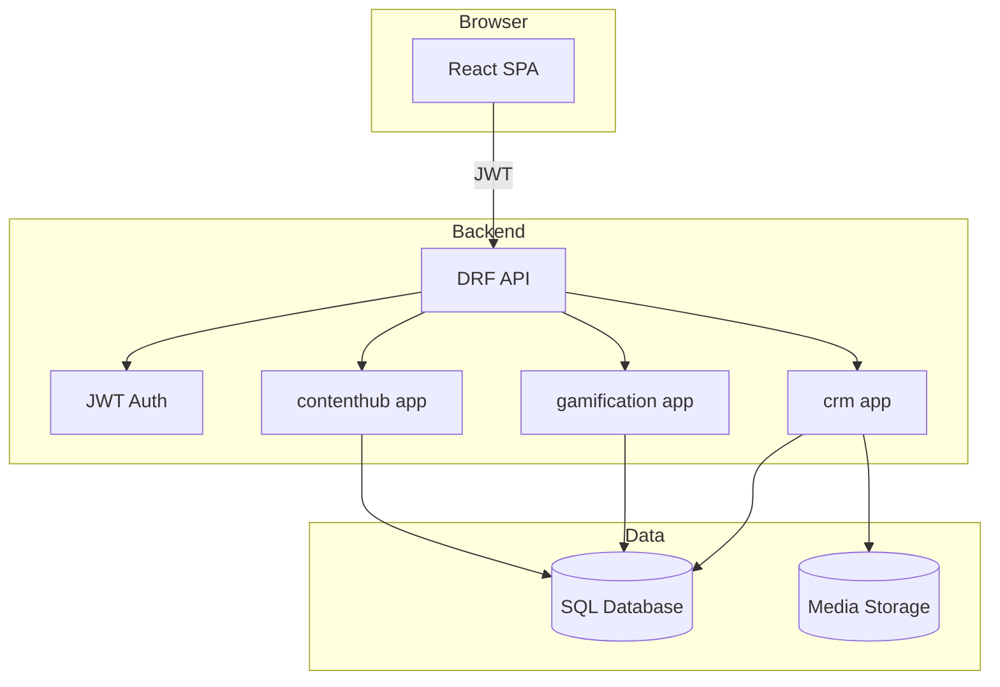
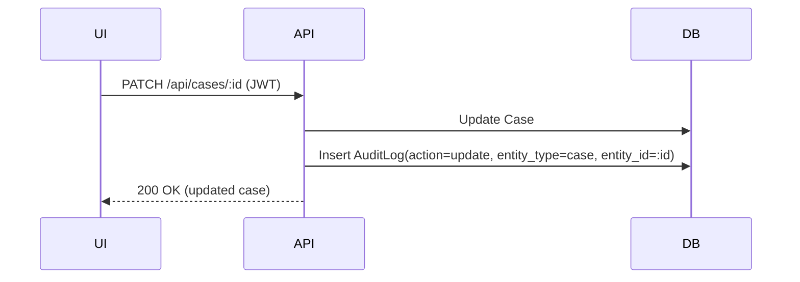
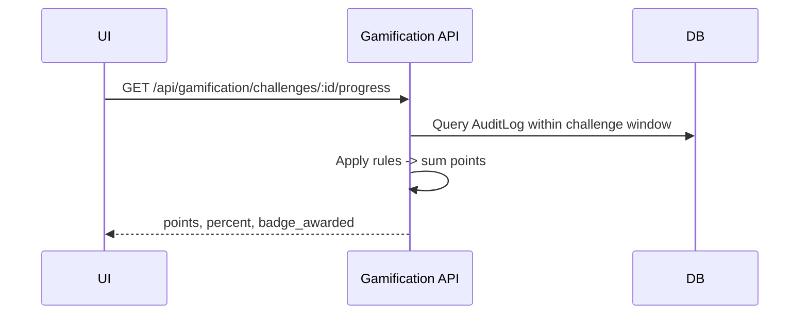

# Architecture

## 1. Component Diagram

## 2. Module Responsibilities

### 2.1 Frontend

- `src/layout/AppShell.tsx`: navigation shell + top bar
- `src/pages/*`: business pages
- `src/components/*`: reusable UI
- `src/api/*`: API client and type definitions

### 2.2 Backend

- `crm`:
  - Core entities
  - Attachments (GenericForeignKey)
  - Audit log generation and query
  - Seed data endpoint
- `gamification`:
  - Challenges, rules, progress calculation via AuditLog
  - Badge awards
  - Leaderboards
- `contenthub`:
  - Knowledge articles
  - Templates
  - Reports (definitions + preview + export)

## 3. Data Flow Examples

### 3.1 Audit Logging Flow

### 3.2 Gamification Points Flow

## 4. Deployment Architecture (Recommended)

- Frontend: static hosting (CDN + object storage) or containerized Nginx
- Backend: containerized API behind HTTPS ingress (ALB/Ingress/Cloud Load Balancer)
- Database: managed Postgres
- Media: object storage (S3/Azure Blob/GCS/OSS)

